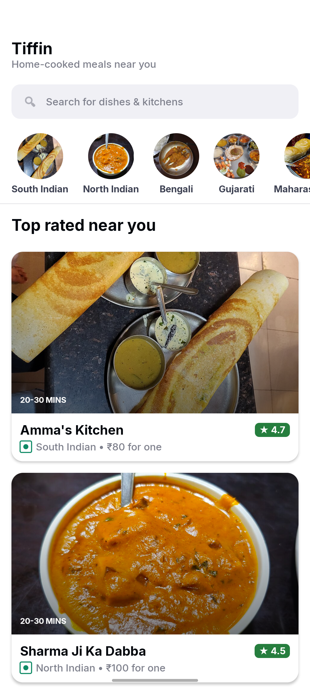
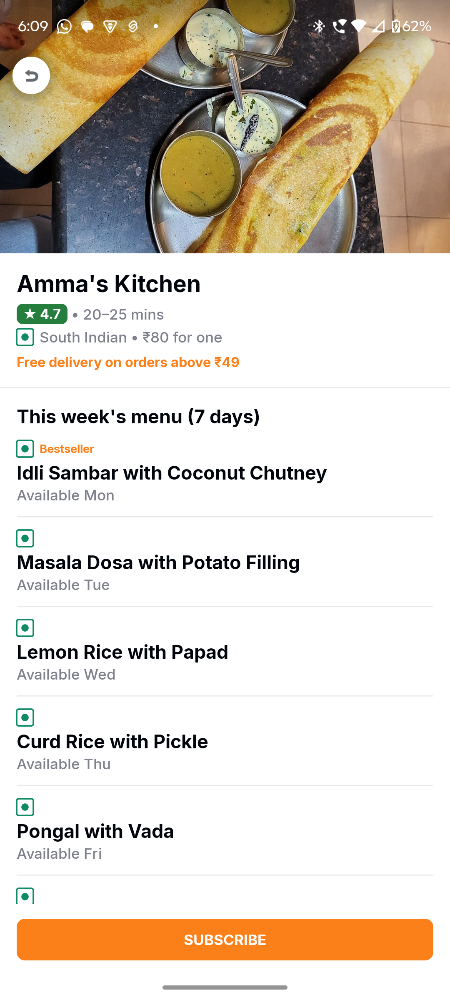
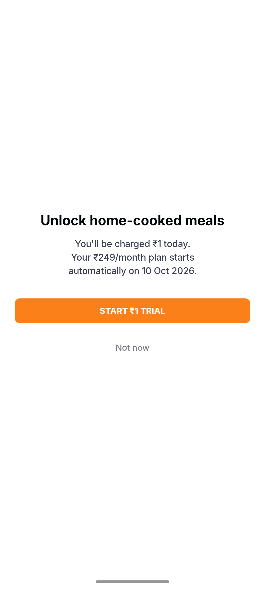

# Tiffin

A Jetpack Compose Android app for ordering daily tiffin from home kitchens nearby. Browse kitchens for free; a ₹1 trial unlocks the subscription, rolling over to ₹249/month after 24 hours. Built for the Propel Spark Android Developer Intern take-home.

Single-module, Kotlin, `minSdk 24`. No backend — twelve kitchens ship as a local JSON asset.

| List | Detail | Paywall |
|------|--------|---------|
|  |  |  |

---

## Build and run

Needs Android Studio (Koala+) and Android SDK platform 35.

1. Open in Android Studio and sync, or build from the command line.
2. Create `local.properties` if missing:
   ```
   sdk.dir=/absolute/path/to/Android/sdk
   ```
3. Build: `./gradlew assembleDebug`
4. Test: `./gradlew testDebugUnitTest`
5. Or press Run on an emulator or device (API 24+).

No API keys or secrets required.

---

## How it works

- **List** — image-led kitchen cards from `assets/kitchens.json`. Live search by name or cuisine, tappable cuisine filter chips, skeleton loading, empty and error states, pull-to-refresh.
- **Detail** — hero photo, rating, cuisine, price, the week's menu (read-only), and a Subscribe button.
- **Paywall** — opens on the third launch or any Subscribe tap. States that ₹1 is charged today and ₹249/month starts on a named date 24 hours later. The purchase is faked but persisted; once paid, the paywall never reappears and the detail shows "SUBSCRIBED ✓".

### Persistence

| Layer | Holds | Survives |
|---|---|---|
| ViewModel + StateFlow | UI state | rotation |
| SavedStateHandle / nav args | selected kitchen id | process death |
| DataStore (Preferences) | `isPaid`, `launchCount`, `trialStartedAt` | force-stop (on disk) |

`isPaid` lives in DataStore so it survives force-stop and reopen.

### Analytics

Four events (tag `TiffinAnalytics`), enough for the full trial funnel:

1. `ListViewed` — catalog rendered.
2. `KitchenViewed(kitchenId)` — detail opened.
3. `PaywallShown(trigger)` — `third_launch` or `subscribe_tap`.
4. `PurchaseCompleted` — purchase succeeded.

---

## Architecture

MVVM, unidirectional data flow, Compose + Material 3.

```
MainActivity → TiffinApp (NavHost)
  ├── ListScreen    ─ ListViewModel    ─┐
  ├── DetailScreen  ─ DetailViewModel  ─┼─ KitchenRepository ─ assets/kitchens.json
  └── PaywallScreen ─ PaywallViewModel ─┘        │
  AppViewModel (launch-count trigger) ───────────┴─ AppPreferences (DataStore)
  Analytics (interface) ◄── LogcatAnalytics
```

Manual DI via `AppContainer`, created in `TiffinApplication`. `kotlinx.serialization` for JSON; `java.time` for the trial date (core-library desugaring for API 24/25).

---

## Design

Swiggy-inspired look (see [design.md](design.md)): white cards with real food photos, green rating pills, veg/non-veg marks, orange (`#FC8019`) CTAs. Inter font (OFL), bundled. A sticker-burst animation plays on purchase, with haptics on the money action.

The 12 food photos in `app/src/main/assets/food/` are from Wikimedia Commons (Creative Commons), loaded with Coil as local assets.

---

## What I cut

I built to a roughly four-hour core and cut deliberately.

- **No Room.** Three flags and a flat 12-row catalog don't need a relational DB. DataStore covers it.
- **No Hilt.** One module doesn't earn a DI framework. A hand-written `AppContainer` is faster to write and read.
- **No delivery-slot flow.** Obvious next feature, but not one of the three required screens.
- **No network layer.** The brief says no backend.
- **Tests cover the money logic only.** The trial-date calculation is the thing that, if wrong, charges people on the wrong day. UI and instrumented tests would be the first addition.
- **The Error state uses a hidden trigger** (long-press the "Tiffin" header) since there's no real network to fail.

---

## Submission contents

- This repo (commit history included).
- Debug APK: `app/build/outputs/apk/debug/app-debug.apk`.
- [TASK2.md](TASK2.md) — the four bugs in the agent-written list code, and the fix.
- [TASK3.md](TASK3.md) — the release note.
- [TASK4.md](TASK4.md) — how I used AI.
- Screen recording: list browsing, live search, cuisine chip filter, detail with menu, subscribe, paywall, purchase burst, "SUBSCRIBED ✓", and force-stop + relaunch proving the paywall doesn't return.
